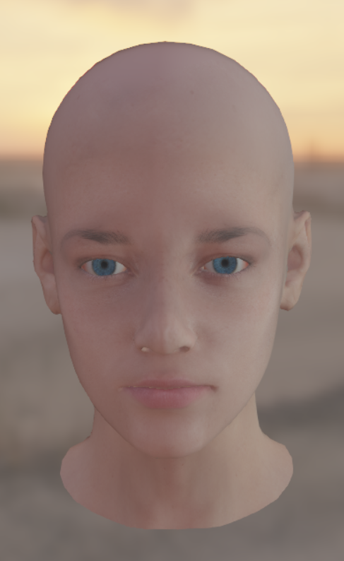

#### Some feature of AtomEngine

> pbr

> skin shading

#### FEATURE
- [x] Physicis Based Rendering
- [x] Image Based Lighting(Spilt Sum Approximate)
- [x] pecentage Closer Soft Shadow Mapping
- [x] Screen Space Ambient Occlusion
- [x] Fast Approximate Anti Alising
- [x] Pre-integral Sub-Surface Scatter
- [x] Async Compute 
- [ ] Editor
- [ ] Deffer Rendering
- [ ] Bloom
- [ ] Depth of Field
- [ ] Motion Blur
- [ ] MultiThread
- [ ] SSSS

#### Refrence

MiniEngine

DiligentEngine

d3d12book
